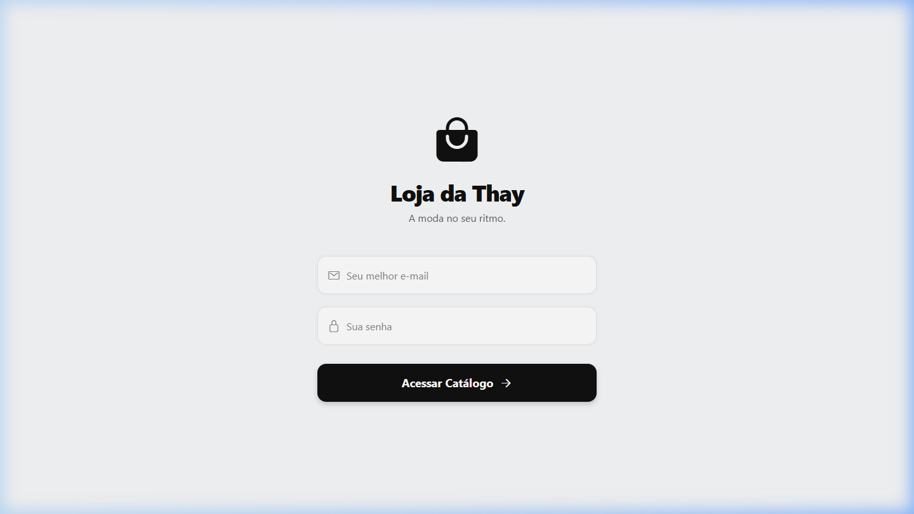
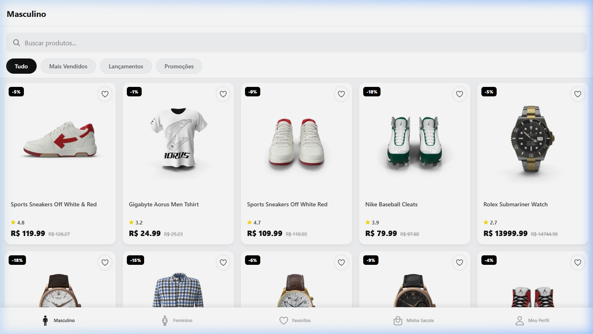
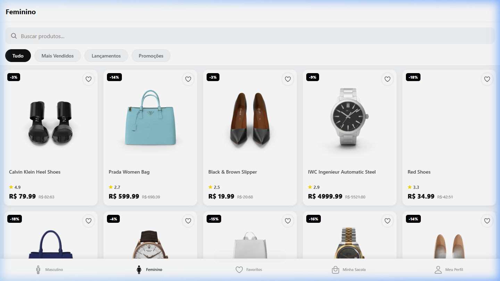
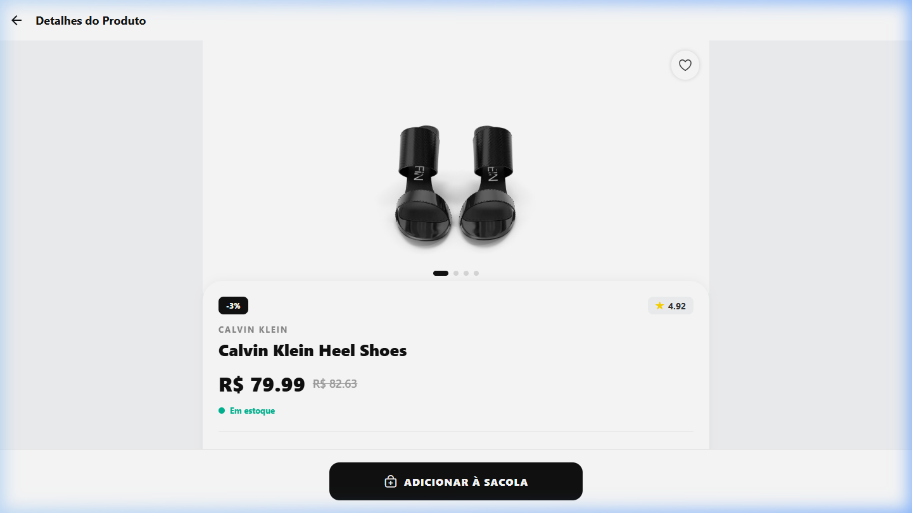
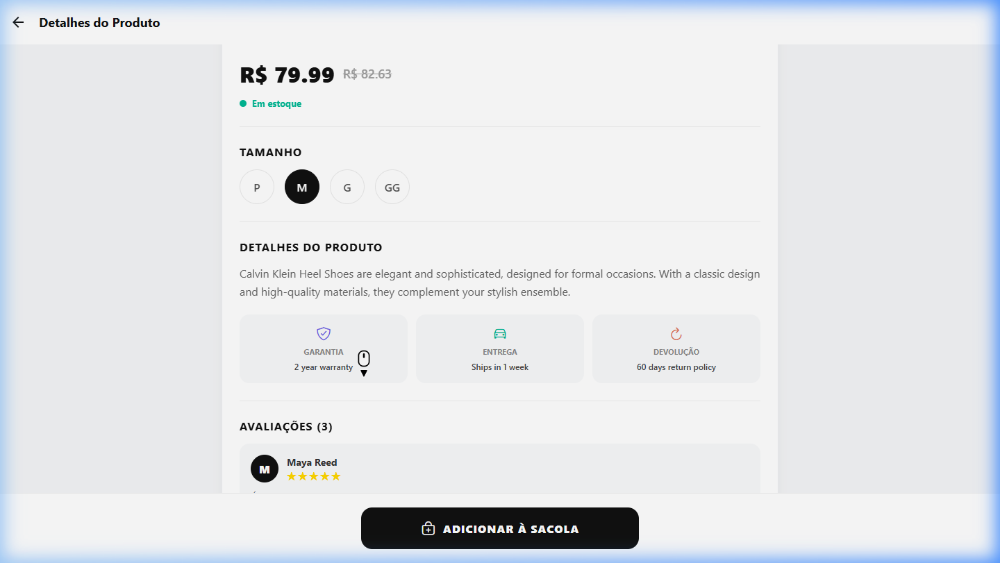
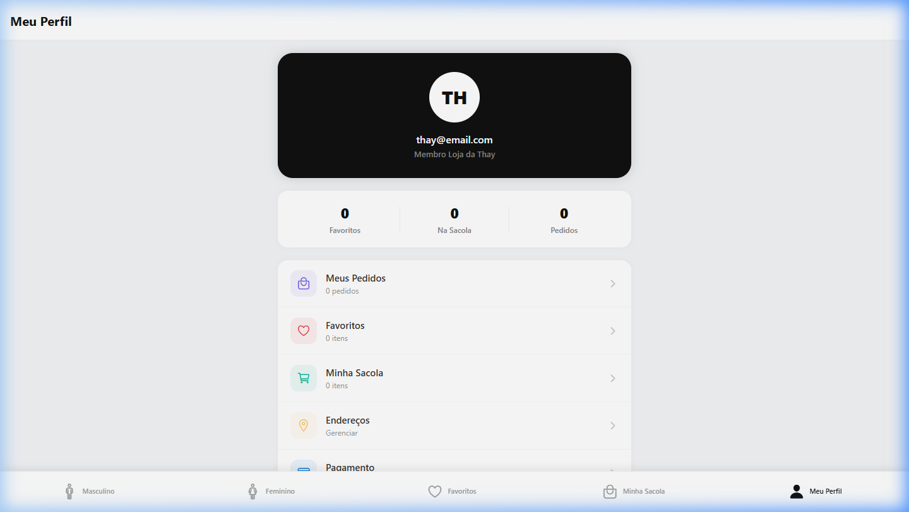

# Loja da Thay — Documentação de Funcionalidades

## 1. Tela de Login

A tela de login apresenta o nome do app "Loja da Thay" com o slogan "A moda no seu ritmo". O usuário deve preencher os campos de e-mail e senha para acessar o catálogo. A validação impede o acesso com campos vazios, exibindo um alerta. Após o login, os dados do usuário são armazenados no estado global via Redux Toolkit (userSlice), e a navegação redireciona para o catálogo.

---

## 2. Catálogo — Aba Masculino

A aba "Masculino" exibe produtos das categorias mens-shirts, mens-shoes e mens-watches, consumidos da API DummyJSON via Axios. Os produtos são apresentados em um grid responsivo com imagens, badges de desconto, avaliação com estrelas, preço atual e preço original riscado. A barra de busca permite pesquisar produtos em tempo real, e os filtros (Tudo, Mais Vendidos, Lançamentos, Promoções) organizam a visualização. O ícone de coração permite favoritar produtos.

---

## 3. Catálogo — Aba Feminino

A aba "Feminino" funciona de forma idêntica à masculina, porém exibe produtos das categorias womens-bags, womens-dresses, womens-jewellery, womens-shoes e womens-watches. A separação por abas permite uma navegação clara e organizada entre os segmentos de moda.

---

## 4. Tela de Detalhes do Produto

Ao clicar em um produto, o app navega para a tela de detalhes passando o ID como parâmetro. A tela exibe: galeria de imagens com indicador de navegação (dots), nome do produto, marca, badge de desconto, avaliação, preço com desconto, status de estoque (em verde, amarelo ou vermelho), seletor de tamanho e botão "Adicionar à Sacola". Ao rolar a página, são exibidas avaliações de usuários (traduzidas para pt-BR) e informações de garantia, prazo de entrega e política de devolução.

---

## 5. Perfil e Logout

A tela de perfil exibe o avatar com as iniciais do usuário, o e-mail salvo no Redux, estatísticas (favoritos, itens na sacola, pedidos) e um menu de opções. O botão "Sair da Conta" realiza o logout, limpando todos os dados armazenados no Redux (usuário, carrinho e favoritos) e redirecionando para a tela de login.

---

## Tecnologias Utilizadas

| Tecnologia | Finalidade |
|---|---|
| React Native (Expo) | Framework mobile multiplataforma |
| Axios | Requisições HTTP à API REST DummyJSON |
| Redux Toolkit | Gerenciamento de estado global |
| React Navigation | Navegação Stack + Bottom Tabs |
| TypeScript | Tipagem estática |
